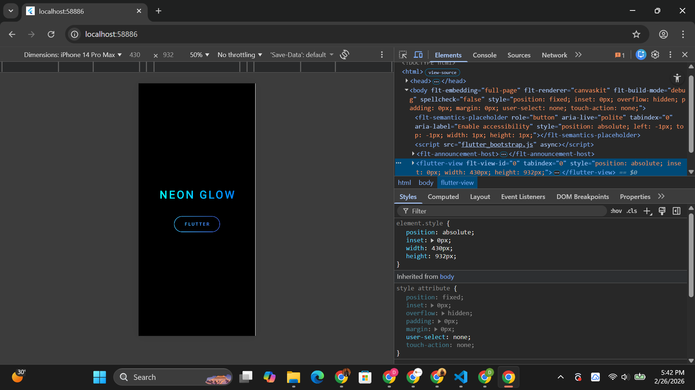

# Neon Glow Demo

A Flutter demo showcasing the **ShaderMask** widget to create animated neon-glow text and button effects — a technique commonly used in gaming UIs, music apps, and dark-themed dashboards.

## Screenshot



## How to Run

```bash
# 1. Clone the repository
git clone https://github.com/Divineitu/widget-presentation-neon-glow-demo.git
cd widget-presentation-neon-glow-demo

# 2. Install dependencies
flutter pub get

# 3. Run the app (Chrome, iOS, Android, or desktop)
flutter run
```

> **Requires:** Flutter SDK 3.x+ and a connected device or emulator.

## Key Widget: `ShaderMask`

`ShaderMask` applies a shader (gradient, image, etc.) as a visual mask over its child widget. It is ideal for creating neon, metallic, or holographic text/button effects without custom painting.

### Attributes Demonstrated

| # | Property | Default Value | What It Does | Why Adjust It |
|---|----------|---------------|--------------|---------------|
| 1 | **`shaderCallback`** | *(required)* | A function that receives the child's `Rect` bounds and returns a `Shader` (e.g. `LinearGradient.createShader`). | Swap gradients, angles, or colour stops to change the glow palette. |
| 2 | **`blendMode`** | `BlendMode.modulate` | Controls how the shader composites with the child's pixels. `modulate` multiplies colours; `srcIn` clips to the child shape; `srcATop` overlays. | Change to `srcIn` for solid gradient fills, or `dstIn` for silhouette effects. |
| 3 | **`child`** | `null` | The widget tree the shader is painted over (Text, Container, Icon, etc.). | Any widget can receive the glow effect — swap `Text` for an `Icon` or `Image`. |

### Additional Properties Used

- **`AnimationController.duration`** — controls pulse speed (set to 2 s).
- **`Color.lerp`** — smoothly interpolates between two neon colours each frame.
- **`Container.decoration.borderRadius`** — rounds the button outline.

## Project Structure

```
lib/
  main.dart        # Single-file demo: MyApp → NeonGlowPage (StatefulWidget)
```

## Built With

- [Flutter](https://flutter.dev/) & Dart
- `ShaderMask`, `LinearGradient`, `AnimationController`
